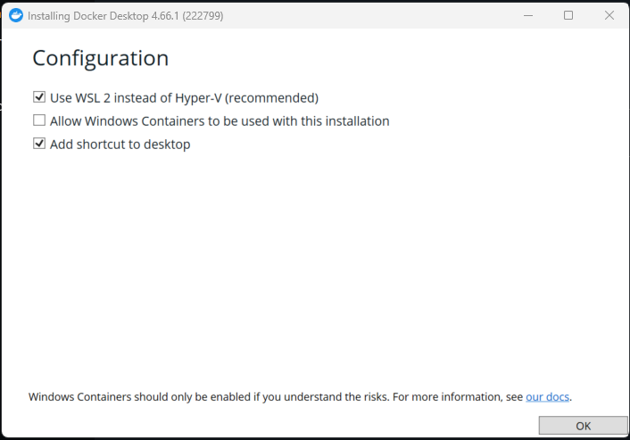

# Contributing to lib-synology-dsm

## Development setup

**Choose one path. Do not mix them.**

| Path | When to use |
|---|---|
| [A — Native (venv)](#path-a--native-venv) | Git Bash on Windows, or Linux/macOS terminal — Python installed locally |
| [B — VS Code Dev Container](#path-b--vs-code-dev-container) | No local Python install, or you want a pre-configured IDE — requires Docker Desktop |

---

## Path A — Native (venv)

No Docker required. Python runs directly on your machine.

### Linux / macOS

```bash
git clone https://github.com/by-openclaw/lib-synology-dsm.git
cd lib-synology-dsm
python -m venv .venv && source .venv/bin/activate
pip install -e ".[dev]"
pre-commit install
pytest tests/unit/ -v   # Expected: 223 passed, 0 failed
```

### Windows 11 with Git Bash

#### Step 1 — Install Python 3.13

Run in Git Bash (or PowerShell):
```bash
winget install Python.Python.3.13
```

#### Step 2 — Disable App Execution Aliases

Windows intercepts `python` in Git Bash and redirects it to the Microsoft Store instead of the real binary.
**Disable the aliases before doing anything else:**

```
Start → Settings → Apps → Advanced app settings → App execution aliases
→ Turn OFF: python.exe
→ Turn OFF: python3.exe
```

#### Step 3 — Add Python to Git Bash PATH

The Python installer does **not** automatically add itself to Git Bash's PATH.
Add it manually — run this once in Git Bash (replace `YourUsername` with your Windows username):

```bash
echo 'export PATH="/c/Users/YourUsername/AppData/Local/Programs/Python/Python313:/c/Users/YourUsername/AppData/Local/Programs/Python/Python313/Scripts:$PATH"' >> ~/.bashrc
source ~/.bashrc
```

Verify:
```bash
python --version   # Expected: Python 3.13.x
pip --version      # Expected: pip 2x.x from .../Python313/...
```

#### Step 4 — Clone and set up

```bash
git clone https://github.com/by-openclaw/lib-synology-dsm.git
cd lib-synology-dsm
python -m venv .venv
source .venv/Scripts/activate   # Git Bash: Scripts not bin
pip install -e ".[dev]"
pre-commit install
```

#### Step 5 — Verify

```bash
pytest tests/unit/ -v
# Expected: 223 passed, 0 failed
```

---

## Path B — VS Code Dev Container

#### Prerequisites

1. Install [Docker Desktop](https://www.docker.com/products/docker-desktop/)
2. Install [VS Code](https://code.visualstudio.com/) + [Dev Containers extension](https://marketplace.visualstudio.com/items?itemName=ms-vscode-remote.remote-containers)

#### Docker Desktop install settings (Windows)

During Docker Desktop installation you will see a configuration screen.
Use these settings — anything else will cause issues:

| Option | Setting | Why |
|---|---|---|
| ✅ Use WSL 2 instead of Hyper-V | **Enable** | Required for Linux containers — better performance, less RAM overhead |
| ☐ Add shortcut to desktop | Optional | No impact |
| ☐ Allow Windows Containers | **Leave disabled** | We use Linux containers only (Python 3.13 image) — enabling this switches Docker to a different engine |



After install, Docker Desktop will prompt for a logout/restart — do it before continuing.

#### Open in container

1. `File → Open Folder` → select the `lib-synology-dsm` folder
2. VS Code shows a popup: **"Reopen in Container"** → click it
   (or: `Ctrl+Shift+P` → `Dev Containers: Reopen in Container`)
3. First time: ~2 min to pull Python 3.13 image and install deps
4. Done — Python 3.13, ruff, mypy, pytest explorer all pre-configured

#### Verify it works

```bash
# Inside the container terminal:
pytest tests/unit/ -v
# Expected: 223 passed, 0 failed, 100% coverage
```

See [.devcontainer/devcontainer.json](.devcontainer/devcontainer.json) for full config.

---

## Pre-commit hooks (mandatory)

After cloning, run `pre-commit install` once. This installs git hooks that run automatically on every `git commit`:

| Hook | What it checks |
|---|---|
| `detect-secrets` | Blocks commits containing passwords, API tokens, private keys |
| `check-added-large-files` | Blocks files > 500KB |
| `end-of-file-fixer` | Ensures files end with newline |
| `ruff` | Python linting (auto-fix) |
| `ruff-format` | Python formatting |

**If detect-secrets flags a false positive** (e.g. a test placeholder like `"secret"`):
```bash
detect-secrets audit .secrets.baseline
# Follow prompts: press 'n' to mark as not a real secret
git add .secrets.baseline
git commit -m "chore: update secrets baseline"
```

**Never bypass the hooks** with `git commit --no-verify` unless you have an explicit reason and review it immediately.

---

## Running unit tests

> **No `.env` needed. No NAS needed. No network needed.** All HTTP calls are mocked.
> Unit tests are completely self-contained — just `pytest tests/unit/ -v` on either Path A or B.

Unit tests are fully offline — no NAS required. All HTTP calls are mocked.

```bash
# Run unit tests with coverage report
pytest tests/unit/ -v

# Terminal output: per-test PASS/FAIL + coverage table
# HTML report: open htmlcov/index.html in browser after run
# Gate: fails if total coverage < 80%
```

Coverage summary:

| Module | Target | Notes |
|---|---|---|
| `client.py` | ≥80% | urllib only — no external HTTP deps |
| `credentials.py` | ≥80% | env vars + Vault providers |
| `filestation.py` | ≥80% | upload/download/list/mkdir/delete |
| `groups.py` | 100% | full ensure/CRUD/members |
| `nfs.py` | 100% | get_rules |
| `shares.py` | ≥80% | full ensure/CRUD/permissions |
| `users.py` | ≥80% | full ensure/CRUD |

---

## Running integration tests (live NAS required)

> **This is where `.env` is needed.** Integration tests connect to a real NAS.
> Skip this entirely if you're just developing and running unit tests.

Integration tests talk to a real Synology NAS. They create and delete test artifacts
in controlled locations. **They never touch existing shares or user data.**

### What the integration test creates and cleans up

| Object | Name | Cleaned up |
|---|---|---|
| DSM user | `rune-test-tmp` | ✅ deleted at end |
| DSM group | `rune-test-group` | ✅ deleted at end |
| Shared folder | `rune-test-share` | ✅ deleted at end |
| FileStation folder | `/{TEST_SHARE}/rune-test-fs-tmp/` | ✅ deleted at end |
| FileStation file | `rune-test-upload.txt` inside above | ✅ deleted with folder |

### Prerequisites on the NAS

1. Create a DSM admin user (e.g. `your-dsm-user`) in DSM → Control Panel → User & Group
2. Add it to the `administrators` group
3. Enable: Control Panel → User & Group → `your-dsm-user` → Applications → DSM = **Allow**
4. Create a read-only audit user (e.g. `your-audit-user`) — normal user, no admin rights
5. NFS service must be enabled if testing NFS rules: Control Panel → File Services → NFS

### Setup env vars

```bash
cp .env.example .env
# Edit .env with your values:
#   NAS_HOST, API_USER, API_PASS, AUDIT_USER, AUDIT_PASS, NFS_CLIENT
```

### Run

```bash
# Option 1 — via env file (if python-dotenv installed)
pip install python-dotenv
source .env && python3 tests/integration/test_live_nas.py

# Option 2 — inline env vars
NAS_HOST=192.168.1.100 \
API_USER=your-dsm-user \
API_PASS=your-password \
AUDIT_USER=your-audit-user \
AUDIT_PASS=your-audit-password \
NFS_CLIENT=192.168.1.0/24 \
TEST_USER_PASS=TmpPass123! \
python3 tests/integration/test_live_nas.py
```

### Output format

```
============================================================
  lib-synology-dsm — Live NAS Integration Test
  Target: https://192.168.1.100:5001/webapi/entry.cgi
============================================================

── Section 1: Auth v7 ─────────────────────────────
  ✅  your-dsm-user login  sid=abc123…
  ✅  your-dsm-user logout
  ✅  your-dsm-user re-login (for subsequent tests)

  ...

── Summary ───────────────────────────────────────
  Total: 42  |  ✅ 40  |  ⚠️ 2  |  ❌ 0
```

- `✅` = PASS
- `⚠️` = WARN (non-blocking — e.g. optional feature not configured on NAS)
- `❌` = FAIL (blocking)

Exit code: `0` if no failures, `1` if any `❌`.

---

## Code standards

- **No external HTTP dependencies** — use `urllib.request` only (no `httpx`, no `requests`)
- **Conventional commits**: `feat:`, `fix:`, `docs:`, `test:`, `chore:`, `refactor:`
- **Formatting**: `ruff format src/ tests/` before committing
- **Linting**: `ruff check src/ tests/` must be clean
- **Types**: `mypy src/synology_dsm/ --ignore-missing-imports` must pass
- **Docstrings**: all public classes and methods — no exceptions
- **ensure() pattern**: all managers must implement idempotent `ensure(name, state="present"|"absent", dry_run=False)`
- **dry_run**: all destructive methods must support `dry_run=True` (no-op + describe what would happen)

## Adding a new module

1. Create `src/synology_dsm/{module}.py`
2. Add unit tests in `tests/unit/test_{module}.py`
3. Add integration tests in `tests/integration/test_live_nas.py` — use isolated test objects, clean up after
4. Export from `src/synology_dsm/__init__.py` if appropriate
5. Update `docs/feature-coverage.md` and `README.md`

## Session management

Always use `DSMClient` as a context manager — it handles login/logout and session cleanup:

```python
with DSMClient(host, port=5001, verify_ssl=False) as client:
    client.login(user, password)
    mgr = ShareManager(client)
    mgr.ensure("my-share", state="present")
# logout called automatically on __exit__
```

Never store session IDs in state — they are short-lived (30 min default on DSM 7.x).
